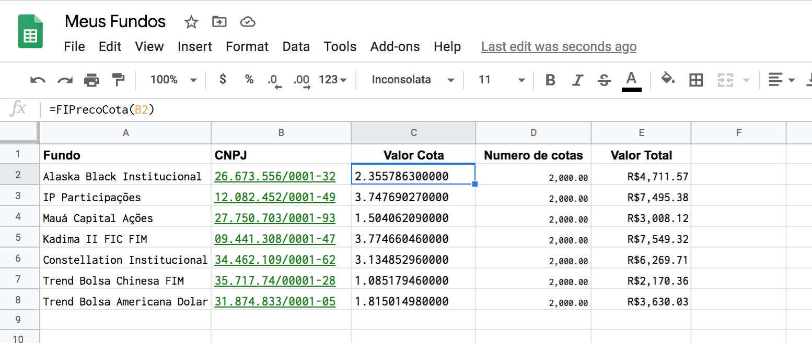
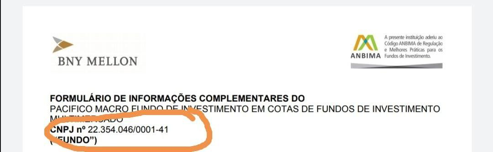
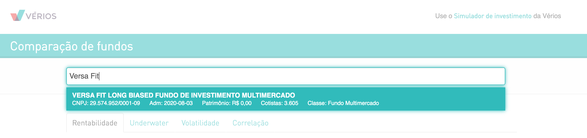
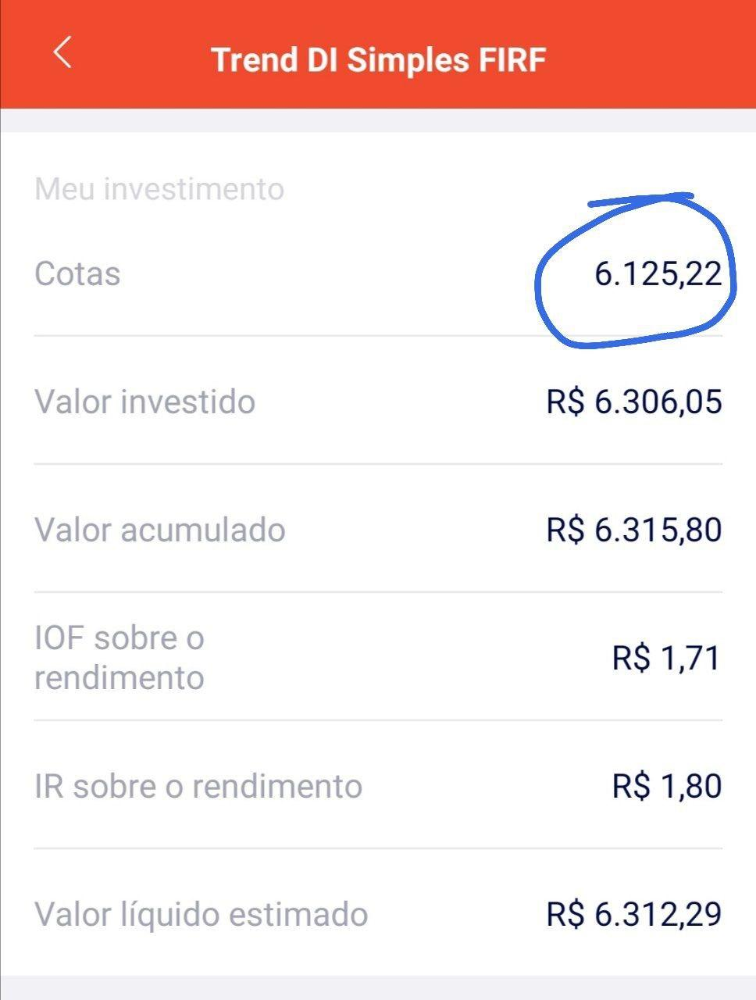

# CotasFI
Importe os valores diários das cotas do seus fundos de investimento automaticamente na suas Planilhas do Google e gerencie melhor seus ativos. 

#  Disclaimer

Os dados são gerados a partir do formato CSV e disponibilizados publicamente pela CVM. Me isento de qualquer erro ou garantias dos valores. Os dados são atualizados uma vez por dia, podendo estar temporariamente diferente dos valores da sua corretora. Peço que, se houver algum problema, entre em contato comigo prontamente que tentarei corrigir. Se você é um desenvolvedor, por favor, abra uma issue ou um pull request.

Um abraço a todos e boas planilhas! 

Manoel Carvalho
https://twitter.com/manoelhc

# Como funciona?

Primeiro, adicione o código abaixo na sua planilha, seguindo os passos:
 * Abra o menu `Ferramentas` ou `Tools` e clique em `Editor de Script` ou `Script Editor`. 
 * Na tela do editor, clique em `arquivo` ou `file`, depois em `novo` (`new`) e enfim `Arquivo de Script` (`Script file`).
 * Coloque o nome `CotasFI.gs` e clique em `OK`.
 * Com o arquivo `CotasFI.gs` aberto, remova todo o conteúdo e cole o código abaixo:

 ```
function FIPrecoCota(cnpj) {
  cnpj = cnpj.replace(/[.\-\/]/g,'');
  lv1 = cnpj.slice(0, 1);
  lv2 = cnpj.slice(1, 3);
  lv3 = cnpj.slice(3, 14);
  url = "https://raw.githubusercontent.com/manoelhc/CotasFI/master/data/"+lv1+"/"+lv2+"/"+lv3+"/values.json";
  jsondata = UrlFetchApp.fetch(url);
  val = JSON.parse(jsondata.getContentText());
  return val["value"];
}
```

 * Salve o arquivo, clicando em `Arquivo` (`File`) e depois em `Salvar`(`Save`).
 * Caso peça, adicione um novo nome para o projeto, como `CotasFI`.

Agora você está pronto para usar a função. Para usá-la, basta digitar em um celula da sua planilha: `=FIPrecoCota(CNPJ_DO_FUNDO)`. Ex.:

Alaska Black Institucional, no caso, seria: `=FIPrecoCota(26.673.556/0001-32)`

# Segurança

Fique tranquilo quanto ao código acima. Ele não está, de maneira alguma, executando ou coletando dados das suas planilhas. A fonte dos dados é totalmente estática e pública.

# Dicas
*Listei alguns fundos aleatoriamente para gerar esta planilha. Não é recomendação!*
Uma forma de organizar os fundos é colocando os CNPJs numa coluna paralela, como:


Como podemos ver, na coluna `C` temos o __Valor Cota__, na célula `C2`, está a chamada da função `=FIPrecoCota(B2)` e assim com as demais.

### Como eu descubro o CNPJ do meu fundo? 
 * Para saber o CNPJ do seu fundo, consulte o prospécto do mesmo. Ex.:


 * Outra forma é consultar no site da Vérios: https://verios.com.br/apps/comparacao/log/otimo/cdi/. Tome cuidado, pois há vários fundos espelhos cuja as cotas são diferentes do fundo original. Ex.:
 

### Como eu descubro o número de cotas que possuo?

Você pode encontrar facilmente no aplicativo da sua corretora. Um exemplo, pela corretora Rico:

